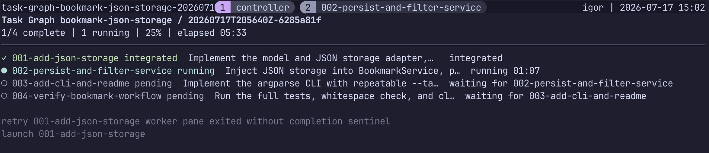

# Task Graph

> Turn an approved implementation plan into task files, a kanban board, and a conservative execution DAG.



## Prerequisites

Codex is required to use this skill. macOS is optional; it only enables the
best-effort desktop notification after a controller-run plan implementation
finishes. Notification delivery still depends on macOS notification permissions
and an active user session.

## Use from Codex

Start with an approved implementation plan, then prompt Codex:

> Invoke `$task-graph tasks` to turn this approved implementation plan into Task Graph artifacts.

This creates the plan-local task briefs, kanban board, and DAG described below.

## What it creates

Running `$task-graph tasks` writes plan-local artifacts below `.agent/<plan-slug>/`:

For example, a generated plan directory can look like this:

```text
.agent/bookmark-json-storage/
├── todo/
├── in-progress/
├── done/
│   ├── 001-add-json-storage.md
│   ├── 002-persist-and-filter-service.md
│   ├── 003-add-cli-and-readme.md
│   └── 004-verify-bookmark-workflow.md
├── kanban.md
└── dag.json
```

- `todo/*.md` contains focused, fresh-context-ready task briefs.
- `kanban.md` summarizes the task folders.
- `dag.json` is the canonical scheduling artifact.

The DAG has a `schemaVersion`, `planSlug`, and task records with stable IDs, task filenames, instructions, predicted paths and symbols, `dependsOn`, `parallelSafe`, and a scheduling rationale.

The main [skill entry point](SKILL.md) stays short as more workflows are added. The complete `tasks` contract lives in [the DAG-generation reference](references/dag-generation.md), which the skill requires agents to read before generating planning artifacts.

## Conservative scheduling

`dependsOn` is authoritative: a task can begin only after all listed task IDs are complete. `parallelSafe` is explanatory evidence, not a second scheduler.

Tasks are parallel only when their predicted edit surfaces are demonstrably disjoint. Shared files, symbols, contracts, tests, generated artifacts, or uncertain overlap are serialized. If no natural prerequisite exists, the later source-plan task depends on the earlier one. Dirty local changes that overlap planned work are called out as a clean-base requirement and make the task non-parallel-safe.

Each `tasks` run validates unique task IDs and filenames, known dependencies, self-dependencies, and graph acyclicity before it replaces the canonical `dag.json`. Rerunning the command refreshes the per-plan DAG and keeps task-file dependencies aligned with it.

## Planning scope

The `tasks` workflow plans work only. The execution controller described below
creates run-scoped branches and worktrees; promotion is always an explicit,
separate action.

## Execution MVP

The execution controller consumes a validated planning DAG without changing its
schema. Start a clean, committed plan with a fixed worker limit:

```bash
python3 scripts/task_graph_cli.py start <plan-slug> --max-workers 4
```

`start` snapshots `dag.json` and every resolved task brief below
`.agent/<plan-slug>/runs/<run-id>/input/`, creates a feature branch and an
integration worktree, and records both the base commit and checked-out base
branch. It then returns a command such as:

```bash
tmux attach-session -t task-graph-<plan-slug>-<run-id>
```

Run that command to observe the controller and worker windows. Each worker pane
shows readable live progress for commands, file changes, agent messages, and
completion or error events. Completed and failed worker panes remain visible so
their final output and tmux exit-status indicator can be inspected. The
controller is the only process that writes state or cherry-picks worker commits.
It runs only dependency-ready tasks, uses fresh worktrees for both the first
attempt and one repair attempt, and blocks only descendants after a second
failure.

State is written to `runs/<run-id>/state.json` with a run lock and durable
atomic replacement. Each attempt retains raw stdout, raw stderr, and a
chronological combined log in `runs/<run-id>/logs/`; failed worktrees remain
available for investigation.
Workers run focused tests from their task briefs and must make exactly one
non-merge commit. The controller deliberately does not run a final full suite
in this MVP.

Each worker runs in `workspace-write` mode and is additionally granted access
only to the repository's shared Git metadata directory, so it can stage and
commit safely from its linked worktree. Python bytecode generation is disabled,
and pytest runs with its cache provider disabled while preserving any existing
`PYTEST_ADDOPTS`; workers therefore do not create `__pycache__/` or
`.pytest_cache/` artifacts.

To recover after interruption:

```bash
python3 scripts/task_graph_cli.py resume <plan-slug> <run-id>
```

`resume` uses the saved input snapshot and reconciles integration state before
scheduling. It reattaches to the live controller when possible and otherwise
starts exactly one replacement in the plan tmux session.

## Inspect and promote a run

Check the newest run for a plan, or select one explicitly:

```bash
python3 scripts/task_graph_cli.py status <plan-slug>
python3 scripts/task_graph_cli.py status <plan-slug> --run-id <run-id>
```

Status is `running`, `succeeded`, `failed`, or `already merged`. Promotion
always requires the run ID, which avoids accidentally merging a concurrent
run:

```bash
python3 scripts/task_graph_cli.py merge <plan-slug> --run-id <run-id>
```

Only the run's `task-graph/<plan-slug>/<run-id>/feature` branch is eligible for
promotion. Worker-attempt branches are never merge candidates. The command
requires every task to be integrated, the recorded base branch to be checked
out, and a clean checkout except for `.agent/<plan-slug>/runs/` artifacts. It
creates a `--no-ff` merge commit with a Task Graph message. If Git reports a
conflict, Task Graph aborts the merge and leaves the target branch unchanged.
Successful promotions persist the target branch, merge SHA, and timestamp, so
repeating the command reports `already merged` without creating another merge.

When a controller completes, it makes one best-effort macOS desktop alert. A
successful run's alert includes the exact `merge` command; a failed run's alert
includes the exact `status` command. Delivery depends on macOS notification
permissions and the active user session, so it is not guaranteed. Task Graph
records the attempted alert outcome (including a safe OS error when delivery
fails) in the run state; use `status` to diagnose a missed alert. Desktop
alerts cannot safely paste or execute terminal commands, so run the displayed
command yourself from the repository.

## Evaluation

Run deterministic validation with:

```bash
python3 -m unittest discover
```

For opt-in behavior-case and controller evaluation workflows, see the contributor
guide in [`evals/README.md`](evals/README.md).

## Install without cloning

Install the skill directly into Codex with:

```bash
curl -fsSL https://raw.githubusercontent.com/igorrendulic/task-graph/main/install.sh | bash
```

Or download the installer first, inspect it, and then run it:

```bash
curl -fsSL https://raw.githubusercontent.com/igorrendulic/task-graph/main/install.sh -o install-task-graph.sh
less install-task-graph.sh
bash install-task-graph.sh
```

The installer needs `curl`, `tar`, and `mktemp`, and installs to
`${CODEX_HOME:-$HOME/.codex}/skills/task-graph`. To update or reinstall an
existing copy, pass `--force`:

```bash
bash install-task-graph.sh --force
```

For a reproducible install, pin a release tag or commit with `--ref`:

```bash
bash install-task-graph.sh --ref v1.0.0
bash install-task-graph.sh --ref 0123456789abcdef
```
