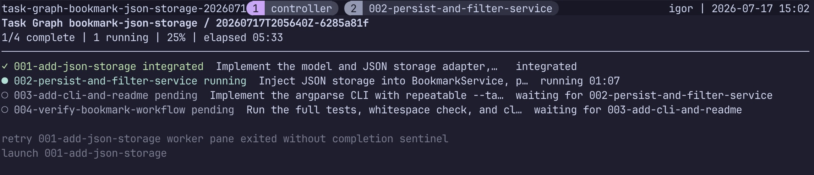

# Task Graph

> Turn an approved implementation plan into task files, a kanban board, and a conservative execution DAG.



## Prerequisites

Codex is required to use this skill. macOS is optional; it only enables the
best-effort desktop notification after a controller-run plan implementation
finishes. Notification delivery still depends on macOS notification permissions
and an active user session.

## Use from Codex

Start with an approved implementation plan, then prompt Codex:

> Invoke `$task-graph tasks` to turn this approved implementation plan into Task Graph artifacts.

This creates the plan-local task briefs, kanban board, and DAG described below.

### Automate the handoff from planning

Add this instruction to your repository's `AGENTS.md` to offer Task Graph when
an approved plan moves into implementation:

```md
When the user has approved an implementation plan and asks to implement it,
offer to generate Task Graph artifacts first. Explain that this creates focused
task briefs, a kanban board, and a dependency-safe DAG. If the user accepts,
immediately invoke `$task-graph tasks` with the approved plan. Otherwise,
continue with the normal implementation workflow. Do not start the Task Graph
execution controller as part of this handoff.
```

## What it creates

Running `$task-graph tasks` writes plan-local artifacts below `.agent/<plan-slug>/`:

For example, a generated plan directory can look like this:

```text
.agent/bookmark-json-storage/
├── todo/
├── in-progress/
├── done/
│   ├── 001-add-json-storage.md
│   ├── 002-persist-and-filter-service.md
│   ├── 003-add-cli-and-readme.md
│   └── 004-verify-bookmark-workflow.md
├── kanban.md
└── dag.json
```

- `todo/*.md` contains focused, fresh-context-ready task briefs.
- `kanban.md` summarizes the task folders.
- `dag.json` is the canonical scheduling artifact.

The DAG has a `schemaVersion`, `planSlug`, and task records with stable IDs, task filenames, instructions, predicted paths and symbols, `dependsOn`, `parallelSafe`, and a scheduling rationale.

The main [skill entry point](SKILL.md) stays short as more workflows are added. The complete `tasks` contract lives in [the DAG-generation reference](references/dag-generation.md), which the skill requires agents to read before generating planning artifacts.

## Start implementation

With a generated DAG and a clean, committed checkout, prompt Codex:

> Invoke `$task-graph start` for `<plan-slug>` with up to 4 workers.

Codex starts the controller and returns an attach command such as:

```bash
tmux attach-session -t task-graph-<plan-slug>-<run-id>
```

Run that command to observe the controller and worker windows. The panes show
live task progress, commands, file changes, agent messages, and completion or
error output; finished worker panes remain available for inspection.

To preview the dashboard with simulated tasks, run this from the repository root:

```bash
tmux new-session -s task-graph-preview \
  'python3 scripts/task_graph_preview.py'
```

The `DEMO` preview repeats a 30-second cycle with changing activity, task phases,
elapsed times, and simulated events. Resize the terminal to inspect compact rows
and hidden-task counts. Press Ctrl+C to exit, or tmux's prefix followed by `d` to
detach and later run `tmux attach-session -t task-graph-preview` to return.
It uses in-memory data and creates no agents, worktrees, or run-state files;
worker transcript windows are not included. You can also run
`python3 scripts/task_graph_preview.py` directly in an existing terminal pane.

The controller dashboard shows each task's current activity and time in that
activity, with separate working, verifying, awaiting integration, and integrating
phases. Active and failed tasks stay above waiting and completed tasks; small
terminals summarize hidden rows instead of rotating pages. Recent timestamped
events remain visible below the task list. Use tmux's prefix followed by `w` to
select a worker window for its full transcript.

Worker activity comes from incremental reads of the retained JSONL logs. Quiet
workers show time since the last event, with an `alive` indicator only after a
successful pane/PID check. Quiet time does not imply a stalled worker. An agent
turn finishing does not mark its task complete: completion requires verification
and integration of its commit.

## Multi-project workspaces

Task Graph can coordinate any number of independently versioned Git projects
under a non-Git parent folder. Declare the projects it may touch in the parent
workspace’s `.agent/task-graph.workspace.json`:

```json
{
  "schemaVersion": 1,
  "projects": [
    { "id": "frontend", "path": "apps/frontend" },
    { "id": "api", "path": "services/api" },
    { "id": "worker", "path": "services/worker" }
  ]
}
```

Each path is safe and workspace-relative and must be an independent clean Git
checkout. The workspace parent itself need not be a repository; undeclared
folders are never touched. Workspace DAGs use schema version 2 and assign each
task a declared `project`; task paths stay project-relative. Planning inspects
all declared projects and uses normal `dependsOn` edges for shared contracts.

```bash
python3 scripts/task_graph_cli.py start <plan-slug> --workspace <workspace-root> --max-workers 4
python3 scripts/task_graph_cli.py status <plan-slug> --workspace <workspace-root>
python3 scripts/task_graph_cli.py resume <plan-slug> <run-id> --workspace <workspace-root>
```

Independent tasks in separate projects can execute concurrently. A dependent
worker waits for its prerequisite to integrate and receives that project’s ID,
integrated commit SHA, and integration worktree as read-only context. Each
declared project has its own base metadata, feature branch, integration worktree, and
worker worktrees, which status reports for review. After a coordinated success,
inspect and promote projects explicitly:

```bash
python3 scripts/task_graph_cli.py checkout <plan-slug> --run-id <run-id> --workspace <workspace-root> --project api
python3 scripts/task_graph_cli.py merge <plan-slug> --run-id <run-id> --workspace <workspace-root> --project api
```

## Inspect and merge completed implementation

After a run succeeds and all its tasks are integrated, check out its feature
branch to inspect it or run local commands:

> Invoke `$task-graph checkout` for `<plan-slug>` run `<run-id>`.

`checkout` accepts only succeeded, unmerged runs and requires the primary
checkout to be clean (except for that plan's run artifacts). It leaves the
integration worktree intact and switches the primary checkout to the feature
branch, then prints the command to return to the recorded base branch. Run it,
then invoke `$task-graph merge` for the same plan and run to create the `--no-ff`
promotion commit. After a successful merge, a clean existing integration
worktree prompts `Remove the clean integration worktree? [y/N]`; only explicit
`y` removes it without force, while declining or local changes retain it. On
conflict, Task Graph aborts safely and leaves the target branch unchanged.

## Install without cloning

Install the skill directly into Codex with:

```bash
curl -fsSL https://raw.githubusercontent.com/igorrendulic/task-graph/main/install.sh | bash
```

Or download the installer first, inspect it, and then run it:

```bash
curl -fsSL https://raw.githubusercontent.com/igorrendulic/task-graph/main/install.sh -o install-task-graph.sh
less install-task-graph.sh
bash install-task-graph.sh
```

The installer needs `curl`, `tar`, and `mktemp`, and installs to
`${CODEX_HOME:-$HOME/.codex}/skills/task-graph`. To update or reinstall an
existing copy, pass `--force`:

```bash
bash install-task-graph.sh --force
```

For a reproducible install, pin a release tag or commit with `--ref`:

```bash
bash install-task-graph.sh --ref v1.0.0
bash install-task-graph.sh --ref 0123456789abcdef
```

## Conservative scheduling

`dependsOn` is authoritative: a task can begin only after all listed task IDs are complete. `parallelSafe` is explanatory evidence, not a second scheduler.

Tasks are parallel only when their predicted edit surfaces are demonstrably disjoint. Shared files, symbols, contracts, tests, generated artifacts, or uncertain overlap are serialized. If no natural prerequisite exists, the later source-plan task depends on the earlier one. Dirty local changes that overlap planned work are called out as a clean-base requirement and make the task non-parallel-safe.

Each `tasks` run validates unique task IDs and filenames, known dependencies, self-dependencies, and graph acyclicity before it replaces the canonical `dag.json`. Rerunning the command refreshes the per-plan DAG and keeps task-file dependencies aligned with it.

## Planning scope

The `tasks` workflow plans work only. The execution controller described below
creates run-scoped branches and worktrees; promotion is always an explicit,
separate action.

## Execution MVP

The execution controller consumes a validated planning DAG without changing its
schema. Start a clean, committed plan with a fixed worker limit:

```bash
python3 scripts/task_graph_cli.py start <plan-slug> --max-workers 4
```

`start` snapshots `dag.json` and every resolved task brief below
`.agent/<plan-slug>/runs/<run-id>/input/`, creates a feature branch and an
integration worktree, and records both the base commit and checked-out base
branch. It then returns a command such as:

```bash
tmux attach-session -t task-graph-<plan-slug>-<run-id>
```

Run that command to observe the controller and worker windows. Each worker pane
shows readable live progress for commands, file changes, agent messages, and
completion or error events. Completed and failed worker panes remain visible so
their final output and tmux exit-status indicator can be inspected. The
controller is the only process that writes state or cherry-picks worker commits.
It runs only dependency-ready tasks, uses fresh worktrees for both the first
attempt and one repair attempt, and blocks only descendants after a second
failure.

An interrupted worker is different from a failed task: when its pane disappears
without a completion sentinel, the controller recovers its exact Codex session
ID from raw JSONL and runs `codex exec resume <session-id>` once in the same
worktree. Existing edits and commits survive; the continuation must amend an
existing task commit rather than add another. Original invocation logs are kept
under `attempt.recoveries`; continuation logs use a `-resume-1` suffix. Missing
session history, failed continuation, or another interruption falls back to the
normal fresh-worktree repair attempt. Recovery requires the same local Codex
session store. `resume` does not interrupt workers that are still alive.

State is written to `runs/<run-id>/state.json` with a run lock and durable
atomic replacement. Each attempt retains raw stdout, raw stderr, and a
chronological combined log in `runs/<run-id>/logs/`; failed worktrees remain
available for investigation.
Workers run focused tests from their task briefs and must make exactly one
non-merge commit. Intentionally empty verification commits are retained during
integration. Before integration, the controller independently checks that the
commit descends from its launch base, that the worktree is clean, and that every
changed path is declared in `predictedPaths`. Rename source and destination paths
both count; `.agent/` changes are rejected. It then runs the frozen task's
verification commands and checks that HEAD and worktree cleanliness are unchanged.

Every executable task needs a verification contract, for example:

```json
"verification": {
  "commands": [["python3", "-m", "unittest", "tests.test_config"]],
  "timeoutSeconds": 300
}
```

Commands are argument arrays executed in the task worktree, in order, without
implicit shell expansion. They run with the controller's local permissions and
environment, so review them as part of the approved plan. Choose reproducible,
noninteractive checks; required dependencies must already be available. Timeout
is per command (default 300 seconds, allowed 1–3600). A timeout kills the command
process group. Verification is polled without blocking dashboard refresh, worker
event collection, or scheduling of independent tasks within the worker limit.
The dashboard shows the active check and its elapsed time. A verifying task
continues to occupy its worker slot, and its dependents wait for integration.
Normal controller shutdown stops its verification commands. After an abrupt
controller loss, a replacement waits for any previous command holding the
attempt's verification lock to exit, then repeats verification before integration.

Use `{"skipReason": "Documentation-only task; no automated check applies."}`
only when appropriate, never to bypass missing dependencies or failing tests.
Skipped automation still requires a valid, clean, in-scope commit. Verification
evidence is stored in each attempt's `verification` record, including the commit
SHA, changed paths, skip reason or commands, exit codes, and log paths. Failing
checks trigger the normal repair policy. Failed worktrees remain available.

`predictedPaths` accepts exact project-relative files and directory prefixes
ending in `/`. Wildcards and unresolved scopes must be refined before execution.
Older DAGs remain readable, but `start` requires this contract; update the plan
and create a fresh run rather than editing an existing run's frozen snapshot.
Old commits awaiting integration without verification evidence are rejected.
The controller does not run a final full suite unless the DAG includes it, and
passing declared checks does not substitute for reviewing acceptance criteria.

Each worker runs in `workspace-write` mode and is additionally granted access
only to the repository's shared Git metadata directory, so it can stage and
commit safely from its linked worktree. Python bytecode generation is disabled,
and pytest runs with its cache provider disabled while preserving any existing
`PYTEST_ADDOPTS`; workers therefore do not create `__pycache__/` or
`.pytest_cache/` artifacts.

To recover after interruption:

```bash
python3 scripts/task_graph_cli.py resume <plan-slug> <run-id>
```

`resume` uses the saved input snapshot and reconciles integration state before
scheduling. It reattaches to the live controller when possible and otherwise
starts exactly one replacement in the plan tmux session.

## Inspect and promote a run

Check the newest run for a plan, or select one explicitly:

```bash
python3 scripts/task_graph_cli.py status <plan-slug>
python3 scripts/task_graph_cli.py status <plan-slug> --run-id <run-id>
```

Status is `running`, `succeeded`, `failed`, or `already merged`. Promotion
always requires the run ID, which avoids accidentally merging a concurrent
run:

```bash
python3 scripts/task_graph_cli.py checkout <plan-slug> --run-id <run-id>
```

Checkout is available only for succeeded, unmerged runs. It requires the
primary checkout to be clean except for `.agent/<plan-slug>/runs/` artifacts,
leaves the integration worktree intact, and switches the primary checkout to
the feature branch. It then prints exact commands to return to the recorded
base branch and merge.

After returning to the base branch printed by `checkout`, promote the run with:

```bash
python3 scripts/task_graph_cli.py merge <plan-slug> --run-id <run-id>
```

Only the run's `task-graph/<plan-slug>/<run-id>/feature` branch is eligible for
promotion. Worker-attempt branches are never merge candidates. The command
requires every task to be integrated, the recorded base branch to be checked
out, and a clean checkout except for `.agent/<plan-slug>/runs/` artifacts. It
creates a `--no-ff` merge commit with a Task Graph message. If Git reports a
conflict, Task Graph aborts the merge and leaves the target branch unchanged.
Successful promotions persist the target branch, merge SHA, and timestamp, so
repeating the command reports `already merged` without creating another merge.
After a successful merge, a clean existing integration worktree prompts `Remove
the clean integration worktree? [y/N]`; only explicit `y` removes it without
force. Declining the prompt or having local changes retains the worktree.

When a controller completes, it makes one best-effort macOS desktop alert. A
successful run's alert includes the exact `checkout` command first, followed by
the `merge` command to use after returning to the recorded base branch; a
failed run's alert includes the exact `status` command. Delivery depends on
macOS notification permissions and the active user session, so it is not
guaranteed. Task Graph records the attempted alert outcome (including a safe OS
error when delivery fails) in the run state; use `status` to diagnose a missed
alert. Desktop alerts cannot safely paste or execute terminal commands, so run
the displayed command yourself from the repository.

## Evaluation

Run deterministic validation with:

```bash
python3 -m unittest discover
```

For opt-in behavior-case and controller evaluation workflows, see the contributor
guide in [`evals/README.md`](evals/README.md).
